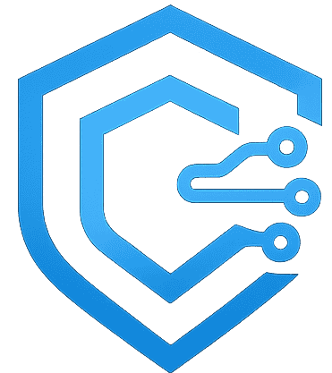

# Cyber Nexora - YOUR NEX-GEN CYBER SHIELD  & VAPT Solutions



A modern, professional cybersecurity company website built with React, TypeScript, and Tailwind CSS.

## 🚀 Live Demo

Visit: [Your deployed URL here]

## 📋 Project Overview

Cyber Nexora is a leading cybersecurity firm specializing in Vulnerability Assessment and Penetration Testing (VAPT), security audits, and comprehensive cyber defense solutions.

**Key Features:**
- 🎨 Modern dark cyber theme with neon blue/purple accents
- ⚡ Smooth animations powered by Framer Motion
- 📱 Fully responsive design
- 🎯 Multi-page structure with React Router
- 🔒 Professional cybersecurity services showcase
- 📊 Case studies and client success stories

## 🛠️ Tech Stack

- **React** 18.3.1 with TypeScript
- **Vite** - Fast build tool
- **Tailwind CSS** - Utility-first styling
- **Shadcn UI** - High-quality React components
- **Framer Motion** - Animation library
- **React Router** v6 - Client-side routing
- **Lucide React** - Beautiful icons

## 📦 Installation

### Prerequisites
- Node.js 16+ 
- npm or yarn

### Setup

```bash
# Clone the repository
git clone <YOUR_GIT_URL>
cd cyber-nexora

# Install dependencies
npm install

# Start development server
npm run dev
```

The application will be available at `http://localhost:8080`

## 🏗️ Build for Production

```bash
# Create optimized production build
npm run build

# Preview production build
npm run preview
```

The built files will be in the `dist` directory.

## 📁 Project Structure

```
src/
├── assets/           # Images and static files
├── components/       # Reusable React components
│   ├── ui/          # Shadcn UI components
│   ├── Navbar.tsx
│   ├── Footer.tsx
│   └── AnimatedSection.tsx
├── pages/           # Page components
│   ├── Home.tsx
│   ├── About.tsx
│   ├── Services.tsx
│   ├── CaseStudies.tsx
│   ├── Contact.tsx
│   └── services/
│       └── WebVAPT.tsx
├── App.tsx          # Main app component with routing
├── index.css        # Global styles and design system
└── main.tsx         # Application entry point
```

## 🎨 Design System

The project uses a comprehensive design system defined in `src/index.css`:

- **Primary Color:** Neon Blue (HSL 195 100% 55%)
- **Secondary Color:** Purple (HSL 270 80% 60%)
- **Background:** Dark (HSL 220 20% 6%)
- **Typography:** Inter font family
- **Animations:** Custom keyframes and Framer Motion

## 📄 Pages

1. **Home** (`/`) - Hero, services overview, stats, CTA
2. **About** (`/about`) - Company info, mission, vision, values
3. **Services** (`/services`) - All services overview
4. **Service Details** - Individual service pages
   - Web Application VAPT (`/services/web-vapt`)
   - Mobile Application VAPT
   - Network Security Audit
   - SOC & Threat Monitoring
   - Cyber Awareness Training
   - Incident Response
5. **Case Studies** (`/case-studies`) - Client success stories
6. **Contact** (`/contact`) - Contact form and information

## 🚢 Deployment

### Vercel (Recommended)

1. Push your code to GitHub
2. Import project in [Vercel](https://vercel.com)
3. Deploy with one click

### Netlify

1. Push your code to GitHub
2. Import project in [Netlify](https://netlify.com)
3. Configure build settings:
   - Build command: `npm run build`
   - Publish directory: `dist`

### Other Platforms

The `dist` folder contains static files that can be deployed to any static hosting service.

## 🔧 Configuration

### Environment Variables
Currently, no environment variables are required. For future backend integration, create a `.env` file.

### SEO
Update meta tags in `index.html` for production deployment.

## 📞 Contact Information

- **Email:** info@cybernexora.com
- **Phone:** +91 9327084456
- **Location:** Surat, Gujarat

## 🤝 Contributing

For internal development:
1. Create a feature branch
2. Make your changes
3. Submit a pull request

## 📝 License

© 2025 Cyber Nexora. All rights reserved.

## 📚 Documentation

For detailed handover documentation, see [PROJECT_HANDOVER.md](PROJECT_HANDOVER.md)

---

**Built with Lovable AI** 🚀
